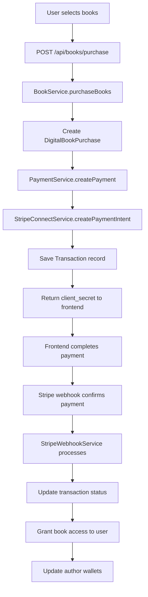
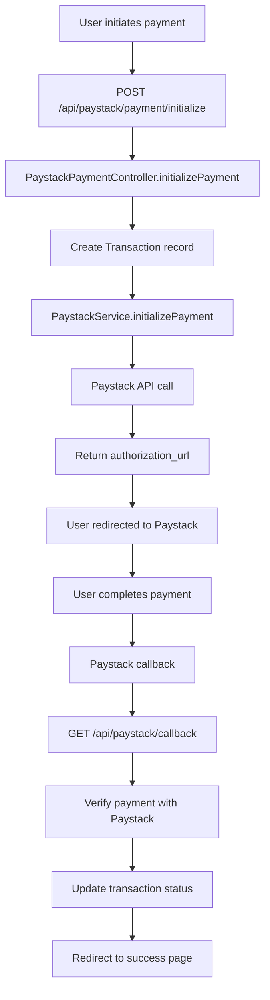
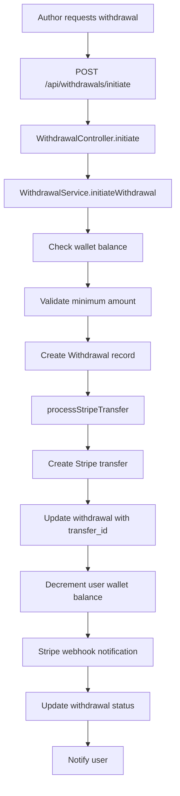
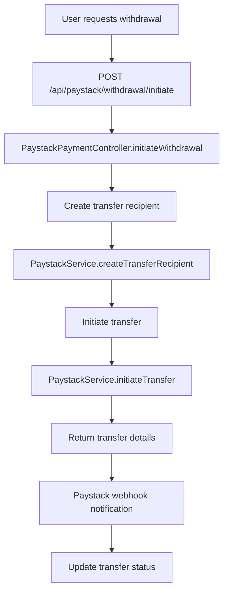

# SBA Reads - Payment & Withdrawal Integration Documentation

## Overview

This document provides comprehensive documentation for the payment and withdrawal flows using both Paystack and Stripe payment providers in the SBA Reads platform. The system supports multiple payment methods and currencies to cater to a global audience.

### Key Features (v2.1.0)
- **Automatic Currency-Based Provider Selection**: System intelligently routes payments to optimal providers based on currency
- **Enhanced Regional Support**: Seamless integration with Paystack for African markets and Stripe for global markets
- **Unified API Experience**: Single endpoints automatically handle provider selection without manual specification
- **Real-time Provider Response**: All payment endpoints return the selected provider for frontend integration

## Payment Providers Integration

### Supported Providers

| Provider | Supported Currencies | Supported Countries | Primary Use Case |
|----------|---------------------|-------------------|------------------|
| **Stripe** | USD, EUR, GBP, CAD, AUD | US, CA, GB, AU, DE, FR, IT, ES, NL, BE | Global payments, subscriptions, and withdrawals |
| **Paystack** | NGN, USD, GHS, KES, ZAR | NG, GH, KE, ZA | African market payments and local transfers |

### Provider Selection Logic

The system automatically selects payment providers based on the currency specified in the request payload. This ensures optimal regional payment processing and compliance.

**Automatic Selection Rules:**
```php
// Currency-based provider selection
$provider = match($currency) {
    'NGN', 'GHS', 'KES', 'ZAR' => 'paystack', // African currencies
    'USD' => 'stripe',                        // Global preference for USD
    'EUR', 'GBP', 'CAD', 'AUD' => 'stripe',   // Stripe-only currencies
    default => 'stripe'                       // Fallback to Stripe
};
```

**Available Providers:**
```php
[
    'stripe' => [
        'name' => 'Stripe',
        'description' => 'Global payment processing',
        'currencies' => ['USD', 'EUR', 'GBP', 'CAD', 'AUD'],
        'countries' => ['US', 'CA', 'GB', 'AU', 'DE', 'FR', 'IT', 'ES', 'NL', 'BE'],
    ],
    'paystack' => [
        'name' => 'Paystack',
        'description' => 'African payment processing',
        'currencies' => ['NGN', 'USD', 'GHS', 'KES', 'ZAR'],
        'countries' => ['NG', 'GH', 'KE', 'ZA'],
    ],
]
```

**Selection Criteria:**
1. **Automatic Currency-Based Selection**: System automatically selects provider based on currency
2. **Regional Optimization**: Paystack for African currencies (NGN, GHS, KES, ZAR), Stripe for global currencies
3. **Currency Support**: Each provider supports specific currencies as defined in the mapping
4. **Fallback Strategy**: Defaults to Stripe for unsupported currencies

## Payment Flow Architecture

### 1. Payment Initialization

#### Stripe Payment Flow (Book Purchase)


#### Paystack Payment Flow


### 2. Payment Endpoints

#### Initialize Payment (Stripe)
**Note**: Stripe payments are handled through book purchase and order endpoints, not a dedicated payment initialization endpoint.

#### Purchase Books (Enhanced with Currency Selection)
**POST** `/api/books/purchase`

**Authentication Required**: Bearer Token

**Request Body:**
```json
{
  "books": [1, 2, 3],
  "currency": "USD"
}
```

**Response:**
```json
{
  "success": true,
  "data": {
    "books": [1, 2, 3],
    "currency": "USD",
    "provider": "stripe",
    "total_amount": 75.99,
    "status": "pending"
  },
  "message": "Book purchase initiated successfully. Use the provided provider for payment processing."
}
```

**Validation Rules:**
- `books`: Required array of book IDs
- `currency`: Required string, exactly 3 characters, must be one of: USD, EUR, GBP, CAD, AUD, NGN, GHS, KES, ZAR

**Provider Selection Logic:**
- **Stripe**: USD, EUR, GBP, CAD, AUD (Global markets)
- **Paystack**: NGN, GHS, KES, ZAR (African markets)
- **USD**: Defaults to Stripe for global preference
```

#### Initialize Payment (Paystack)
**POST** `/api/paystack/payment/initialize`

**Authentication Required**: Bearer Token

**Request Body:**
```json
{
  "amount": 5000,
  "currency": "NGN",
  "purpose": "digital_book_purchase",
  "purpose_id": 123,
  "description": "Purchase of books"
}
```

**Response:**
```json
{
  "success": true,
  "data": {
    "transaction_id": "uuid-here",
    "authorization_url": "https://checkout.paystack.com/xyz123",
    "access_code": "code_xyz123",
    "reference": "paystack_transaction-id_xyz123",
    "amount": 5000,
    "currency": "NGN",
    "amount_naira": 5000
  }
}
```

### 3. Payment Verification

#### Check Payment Status
**POST** `/api/transaction/payment/status`

**Authentication Required**: Bearer Token

**Request Body:**
```json
{
  "payment_intent_id": "pi_3OjXYZabcdef",
  "transaction_id": "uuid-here"
}
```

### 4. Order Endpoints

#### Create Order (Enhanced with Currency Selection)
**POST** `/api/order`

**Authentication Required**: Bearer Token

**Request Body:**
```json
{
  "books": [
    {
      "book_id": 1,
      "quantity": 2
    },
    {
      "book_id": 2, 
      "quantity": 1
    }
  ],
  "delivery_address": "123 Main Street, City, Country",
  "currency": "USD"
}
```

**Response:**
```json
{
  "success": true,
  "data": {
    "order": {
      "id": "order-id",
      "order_number": "ORD-123456",
      "total_amount": 45.99,
      "status": "pending",
      "tracking_number": "TRK-ABCD-123456"
    },
    "transaction": {
      "id": "transaction-id",
      "reference": "ord_xyz123",
      "payment_intent_id": "pi_stripe_or_paystack_id",
      "amount": 45.99,
      "currency": "USD",
      "status": "pending"
    },
    "provider": "stripe",
    "currency": "USD"
  },
  "message": "Order created successfully. Please proceed to payment."
}
```

**Validation Rules:**
- `books`: Required array with minimum 1 item
- `books.*.book_id`: Required, must exist in books table
- `books.*.quantity`: Required integer, minimum 1
- `delivery_address`: Required string, max 500 characters
- `currency`: Required string, exactly 3 characters, must be one of: USD, EUR, GBP, CAD, AUD, NGN, GHS, KES, ZAR

#### Get User Orders
**GET** `/api/order/my-orders`

**Authentication Required**: Bearer Token

#### Track Order
**GET** `/api/order/track/{tracking_id}`

**Authentication Required**: Bearer Token

### 5. Additional Payment Endpoints

#### User Payment Methods

**List Payment Methods**
**GET** `/api/user/payment_method/list`

**Authentication Required**: Bearer Token

**Response:**
```json
{
  "success": true,
  "data": [
    {
      "id": 1,
      "type": "card",
      "provider": "stripe",
      "payment_data": {
        "card_last4": "4242",
        "card_brand": "visa",
        "exp_month": 12,
        "exp_year": 2025
      },
      "is_default": true
    }
  ]
}
```

**Add Card**
**POST** `/api/user/payment_method/add-card`

**Authentication Required**: Bearer Token

**Request Body:**
```json
{
  "payment_method_id": "pm_1234567890"
}
```

**Add Bank Account**
**POST** `/api/user/payment_method/add-bank-account`

**Authentication Required**: Bearer Token

**Request Body:**
```json
{
  "account_number": "0123456789",
  "country": "NG",
  "sort_code": "057",
  "routing_number": "011000015"
}
```

**Delete Payment Method**
**POST** `/api/user/payment_method/delete`

**Authentication Required**: Bearer Token

**Request Body:**
```json
{
  "payment_method_id": "pm_1234567890"
}
```

#### Transaction Management

**Get My Transactions**
**GET** `/api/transaction/my-transactions`

**Authentication Required**: Bearer Token

**Query Parameters:**
- `status`: Filter by transaction status
- `type`: Filter by transaction type
- `per_page`: Results per page

**Get Single Transaction**
**GET** `/api/transaction/{id}`

**Authentication Required**: Bearer Token

**Get Author Transactions**
**GET** `/api/author/transactions`

**Authentication Required**: Bearer Token (Author role)

#### Order Endpoints

**Create Order**
**POST** `/api/order`

**Authentication Required**: Bearer Token

**Get User Orders**
**GET** `/api/order/my-orders`

**Authentication Required**: Bearer Token

**Track Order**
**GET** `/api/order/track/{tracking_id}`

**Authentication Required**: Bearer Token

#### Verify Payment (General)
**GET** `/api/transaction/verify`

**Authentication Required**: Bearer Token

**Query Parameters:**
- `payment_intent_id`: Stripe payment intent ID
- `reference`: Transaction reference

**Response:**
```json
{
  "success": true,
  "message": "Payment verified successfully",
  "data": {
    "reference": "dig_67890abcde",
    "status": "succeeded",
    "amount": 25.99,
    "currency": "usd",
    "payment_provider": "stripe",
    "created_at": "2024-01-15T10:30:00.000000Z"
  }
}
```

#### Paystack Callback
**GET** `/api/paystack/callback`

**Query Parameters:**
- `reference`: Paystack payment reference

**Response:** Redirects to success/failure page based on payment status

## Withdrawal Flow Architecture

### 1. Withdrawal Process

#### Stripe Connect Withdrawal Flow


#### Paystack Withdrawal Flow


### 2. Withdrawal Endpoints

#### Initiate Withdrawal
**POST** `/api/withdrawals/initiate`

**Authentication Required**: Bearer Token

**Request Body:**
```json
{
  "amount": 50.00,
  "currency": "usd",
  "description": "Monthly earnings withdrawal",
  "withdrawal_method": "bank_transfer",
  "bank_account_id": "ba_1234567890"
}
```

**Response:**
```json
{
  "success": true,
  "message": "Withdrawal initiated successfully",
  "data": {
    "id": "550e8400-e29b-41d4-a716-446655440000",
    "reference": "wd__67890abcde",
    "amount": 50.00,
    "currency": "usd",
    "status": "pending",
    "description": "Monthly earnings withdrawal",
    "withdrawal_method": "bank_transfer",
    "bank_account_id": "ba_1234567890",
    "created_at": "2024-01-15T10:30:00.000000Z",
    "updated_at": "2024-01-15T10:30:00.000000Z"
  }
}
```

**Validation Rules:**
- `amount`: Required, numeric, minimum $1.00
- `currency`: Optional, defaults to "usd"
- `description`: Optional
- `withdrawal_method`: Optional, defaults to "bank_transfer"
- `bank_account_id`: Optional, Stripe bank account ID

**Business Logic:**
- User must have sufficient wallet balance
- Minimum withdrawal amount is $1.00
- User must have connected Stripe account (kyc_account_id)
- Withdrawal creates Stripe transfer immediately
- User wallet balance is decremented upon successful transfer

#### Get Withdrawal History
**GET** `/api/withdrawals/history`

**Authentication Required**: Bearer Token

**Query Parameters:**
- `status`: Filter by status (pending, processing, succeeded, failed, cancelled)
- `per_page`: Results per page (default: 15)
- Standard pagination parameters supported

**Response:**
```json
{
  "success": true,
  "message": "Withdrawal history retrieved successfully",
  "data": {
    "current_page": 1,
    "data": [
      {
        "id": "550e8400-e29b-41d4-a716-446655440000",
        "reference": "wd__67890abcde",
        "amount": 50.00,
        "currency": "usd",
        "status": "succeeded",
        "description": "Monthly earnings withdrawal",
        "created_at": "2024-01-15T10:30:00.000000Z",
        "processed_at": "2024-01-15T10:35:00.000000Z"
      }
    ],
    "total": 5,
    "per_page": 15,
    "current_page": 1,
    "last_page": 1
  }
}
```

#### Get Withdrawal Details
**GET** `/api/withdrawals/{id}`

**Authentication Required**: Bearer Token

**Response:**
```json
{
  "success": true,
  "message": "Withdrawal details retrieved successfully",
  "data": {
    "id": "550e8400-e29b-41d4-a716-446655440000",
    "reference": "wd__67890abcde",
    "amount": 50.00,
    "currency": "usd",
    "status": "succeeded",
    "description": "Monthly earnings withdrawal",
    "withdrawal_method": "bank_transfer",
    "bank_account_id": "ba_1234567890",
    "stripe_transfer_id": "tr_1234567890",
    "created_at": "2024-01-15T10:30:00.000000Z",
    "updated_at": "2024-01-15T10:30:00.000000Z",
    "processed_at": "2024-01-15T10:35:00.000000Z",
    "payout_data": {
      "transfer_id": "tr_1234567890",
      "amount": 50.00,
      "currency": "usd",
      "destination": "acct_1234567890"
    },
    "user": {
      "id": 1,
      "name": "John Doe",
      "email": "john@example.com"
    }
  }
}
```

### 3. Paystack Withdrawal Endpoints

#### Get Paystack Balance
**GET** `/api/paystack/balance`

**Authentication Required**: Bearer Token

**Response:**
```json
{
  "success": true,
  "data": {
    "currency": "NGN",
    "balance": 150000
  }
}
```

#### Initiate Paystack Withdrawal
**POST** `/api/paystack/withdrawal/initiate`

**Authentication Required**: Bearer Token

**Request Body:**
```json
{
  "amount": 50000,
  "bank_code": "057",
  "account_number": "0123456789",
  "account_name": "John Doe"
}
```

**Response:**
```json
{
  "success": true,
  "data": {
    "transfer_code": "TRF_xyz123abc",
    "reference": "paystack_transfer_xyz123",
    "amount": 50000,
    "currency": "NGN"
  }
}
```

**Validation Rules:**
- `amount`: Required, numeric, minimum 100 (NGN)
- `bank_code`: Required, Nigerian bank code
- `account_number`: Required, exactly 10 digits
- `account_name`: Required, account holder name

## Webhook Integration

### Stripe Webhooks

**Endpoint**: `/api/webhooks/stripe`

**Supported Events:**
- `payment_intent.succeeded` - Payment completed successfully
- `payment_intent.payment_failed` - Payment failed
- `transfer.succeeded` - Withdrawal completed
- `transfer.failed` - Withdrawal failed

**Webhook Processing:**
- Processes successful digital book purchases
- Processes successful orders
- Updates transaction statuses
- Handles author payouts
- Creates webhook event records

**Webhook Payload Example:**
```json
{
  "id": "evt_1234567890",
  "type": "payment_intent.succeeded",
  "data": {
    "object": {
      "id": "pi_1234567890",
      "amount": 2599,
      "currency": "usd",
      "status": "succeeded",
      "metadata": {
        "user_id": "123",
        "purpose": "digital_book_purchase",
        "purpose_id": "456"
      }
    }
  }
}
```

### Paystack Webhooks

**Endpoint**: `/api/paystack/webhook`

**Supported Events:**
- `charge.success` - Payment completed
- `transfer.success` - Transfer completed
- `transfer.failed` - Transfer failed
- `subscription.create` - Subscription created
- `subscription.disable` - Subscription disabled

**Security:** Webhook signature verification using `x-paystack-signature` header

**Webhook Payload Example:**
```json
{
  "event": "charge.success",
  "data": {
    "reference": "paystack_transaction-id_xyz123",
    "amount": 500000,
    "currency": "NGN",
    "status": "success",
    "customer": {
      "email": "user@example.com"
    },
    "metadata": {
      "user_id": "123",
      "purpose": "digital_book_purchase",
      "purpose_id": "456"
    }
  }
}
```

## Database Schema

### Transactions Table
```sql
CREATE TABLE transactions (
    id UUID PRIMARY KEY,
    user_id BIGINT REFERENCES users(id) ON DELETE CASCADE,
    reference VARCHAR(255) UNIQUE,
    payment_intent_id VARCHAR(255) UNIQUE NULL,
    payment_client_secret VARCHAR(255) UNIQUE NULL,
    status ENUM('pending', 'succeeded', 'failed', 'processing', 'refunded', 'available', 'requested', 'declined', 'approved', 'sent', 'settled', 'completed', 'locked', 'withdrawn', 'on_hold', 'expired') DEFAULT 'pending',
    currency VARCHAR(10) DEFAULT 'usd',
    amount DECIMAL(15, 2),
    amount_usd DECIMAL(15, 2) NULL,
    amount_naira DECIMAL(15, 2) NULL,
    exchange_rate DECIMAL(10, 4) NULL,
    description VARCHAR(255) NULL,
    payment_provider VARCHAR(50) DEFAULT 'stripe',
    paystack_reference VARCHAR(255) UNIQUE NULL,
    paystack_authorization_code VARCHAR(255) NULL,
    paystack_response JSON NULL,
    type ENUM('purchase', 'earning', 'payout', 'refund', 'fee', 'bonus', 'adjustment', 'others') DEFAULT 'purchase',
    purchased_by BIGINT REFERENCES users(id) ON DELETE SET NULL,
    direction ENUM('credit', 'debit', 'other') NULL,
    available_at TIMESTAMP NULL,
    payout_data JSON NULL,
    purpose_type VARCHAR(255), -- Polymorphic relationship
    purpose_id VARCHAR(255),   -- Polymorphic relationship
    meta_data JSON NULL,
    created_at TIMESTAMP,
    updated_at TIMESTAMP
);
```

### Withdrawals Table
```sql
CREATE TABLE withdrawals (
    id UUID PRIMARY KEY,
    user_id BIGINT REFERENCES users(id) ON DELETE CASCADE,
    reference VARCHAR(255) UNIQUE,
    amount DECIMAL(10, 2),
    currency VARCHAR(3) DEFAULT 'usd',
    status ENUM('pending', 'processing', 'succeeded', 'failed', 'cancelled') DEFAULT 'pending',
    withdrawal_method VARCHAR(255) DEFAULT 'bank_transfer',
    bank_account_id VARCHAR(255) NULL,
    stripe_transfer_id VARCHAR(255) NULL,
    payout_data JSON NULL,
    meta_data JSON NULL,
    description TEXT NULL,
    failure_reason TEXT NULL,
    processed_at TIMESTAMP NULL,
    created_at TIMESTAMP,
    updated_at TIMESTAMP,
    
    INDEX idx_user_status (user_id, status),
    INDEX idx_reference (reference),
    INDEX idx_stripe_transfer (stripe_transfer_id)
);
```

### Paystack Transactions Table
```sql
CREATE TABLE paystack_transactions (
    id UUID PRIMARY KEY,
    transaction_id UUID REFERENCES transactions(id),
    user_id BIGINT REFERENCES users(id),
    paystack_reference VARCHAR(255) UNIQUE,
    paystack_transaction_id VARCHAR(255),
    paystack_authorization_code VARCHAR(255),
    paystack_customer_code VARCHAR(255),
    paystack_plan_code VARCHAR(255),
    paystack_subscription_code VARCHAR(255),
    amount_kobo DECIMAL(15, 2),
    amount_naira DECIMAL(15, 2),
    fees_kobo DECIMAL(15, 2),
    currency VARCHAR(3),
    gateway_response VARCHAR(255),
    channel VARCHAR(255),
    ip_address VARCHAR(45),
    customer_email VARCHAR(255),
    customer_name VARCHAR(255),
    customer_phone VARCHAR(255),
    status VARCHAR(50),
    paid_at TIMESTAMP NULL,
    metadata JSON,
    paystack_response JSON,
    created_at TIMESTAMP,
    updated_at TIMESTAMP
);
```

### Payment Methods Table
```sql
CREATE TABLE payment_methods (
    id BIGINT PRIMARY KEY AUTO_INCREMENT,
    user_id BIGINT REFERENCES users(id) ON DELETE CASCADE,
    type ENUM('card', 'bank_account') NOT NULL,
    provider VARCHAR(50) DEFAULT 'stripe',
    provider_payment_method_id VARCHAR(255),
    payment_data JSON,
    purpose ENUM('payment', 'payout') DEFAULT 'payment',
    is_default BOOLEAN DEFAULT FALSE,
    metadata JSON,
    country_code VARCHAR(2),
    created_at TIMESTAMP,
    updated_at TIMESTAMP
);
```

## Error Handling

### Common Error Responses

All endpoints use a consistent error response format based on the `ApiResponse` trait:

**Insufficient Wallet Balance:**
```json
{
  "success": false,
  "message": "Insufficient wallet balance for withdrawal",
  "data": null
}
```

**Payment Processing Failed:**
```json
{
  "success": false,
  "message": "Payment processing failed: Insufficient funds",
  "data": null
}
```

**Validation Errors:**
```json
{
  "success": false,
  "message": "Validation failed",
  "data": {
    "amount": ["The amount field is required."],
    "currency": ["The currency field is required."]
  }
}
```

**Authentication Required:**
```json
{
  "message": "Unauthenticated."
}
```

**Not Found:**
```json
{
  "success": false,
  "message": "Withdrawal not found",
  "data": null
}
```

**Stripe Errors:**
```json
{
  "success": false,
  "message": "Stripe transfer failed: Insufficient funds",
  "data": null
}
```

**Paystack Errors:**
```json
{
  "success": false,
  "message": "Payment initialization failed: Invalid currency",
  "data": null
}
```

### Status Codes

- **200**: Success
- **201**: Created (for successful withdrawal initiation)
- **400**: Bad Request (validation errors, business logic errors)
- **401**: Unauthorized (authentication required)
- **403**: Forbidden (insufficient permissions)
- **404**: Not Found (resource not found)
- **500**: Internal Server Error (system errors, third-party API failures)

## Security Considerations

1. **API Keys**: Secure storage of Stripe and Paystack API keys
2. **Webhook Verification**: Validate webhook signatures from both providers
3. **PCI Compliance**: Never store raw card details
4. **Rate Limiting**: Implement rate limiting on payment endpoints
5. **Input Validation**: Validate all payment and withdrawal requests

## Testing

### Test Cards (Stripe)
- **Success**: 4242 4242 4242 4242
- **Failure**: 4000 0000 0000 0002
- **3D Secure**: 4000 0025 0000 3155

### Test Banks (Paystack)
- **Success**: 057 (Zenith Bank test account)
- **Failure**: Use invalid account numbers

## Monitoring & Logging

### Key Metrics to Monitor
- Payment success/failure rates
- Average transaction processing time
- Withdrawal processing time
- Webhook delivery success rates
- Currency distribution

### Logging
All payment and withdrawal activities are logged in:
- `payment_audit` table
- Application logs
- CloudWatch/Sentry for error tracking

## Troubleshooting

### Common Issues

1. **Webhook Delivery Failures**
   - Check endpoint accessibility
   - Verify signature validation
   - Monitor retry mechanisms

2. **Currency Conversion Issues**
   - Verify currency support
   - Check conversion rates
   - Validate amount formatting

3. **Provider-specific Errors**
   - Check provider status pages
   - Verify API key validity
   - Review provider documentation

## Support Contacts

- **Stripe Support**: https://support.stripe.com/
- **Paystack Support**: https://support.paystack.com/
- **Technical Support**: support@sba-reads.com

## Version History

| Version | Date | Changes |
|---------|------|---------|
| 1.0.0 | 2024-01-15 | Initial payment integration |
| 1.1.0 | 2024-02-01 | Added Paystack support |
| 1.2.0 | 2024-03-15 | Enhanced withdrawal system |
| 2.0.0 | 2024-08-28 | **Major Update**: Comprehensive documentation update based on actual codebase implementation. Updated all endpoints, schemas, and flows to match current Laravel 12 implementation |
| 2.1.0 | 2025-01-15 | **Currency-Based Provider Selection**: Added automatic payment provider selection based on currency. Enhanced `/api/books/purchase` and `/api/order` endpoints to accept currency field and return selected provider. Implemented regional optimization for payment processing. |

---

*This documentation has been thoroughly updated to reflect the actual codebase implementation. Last updated: January 2025*
### Common Issues

1. **Webhook Delivery Failures**
   - Check endpoint accessibility
   - Verify signature validation
   - Monitor retry mechanisms

2. **Currency Conversion Issues**
   - Verify currency support
   - Check conversion rates
   - Validate amount formatting

3. **Provider-specific Errors**
   - Check provider status pages
   - Verify API key validity
   - Review provider documentation

## Support Contacts

- **Stripe Support**: https://support.stripe.com/
- **Paystack Support**: https://support.paystack.com/
- **Technical Support**: support@sba-reads.com

## Version History

| Version | Date | Changes |
|---------|------|---------|
| 1.0.0 | 2024-01-15 | Initial payment integration |
| 1.1.0 | 2024-02-01 | Added Paystack support |
| 1.2.0 | 2024-03-15 | Enhanced withdrawal system |

---

*This documentation is maintained by the SBA Reads Engineering Team. Last updated: January 2024*
- **Technical Support**: support@sba-reads.com

## Version History

| Version | Date | Changes |
|---------|------|---------|
| 1.0.0 | 2024-01-15 | Initial payment integration |
| 1.1.0 | 2024-02-01 | Added Paystack support |
| 1.2.0 | 2024-03-15 | Enhanced withdrawal system |

---

*This documentation is maintained by the SBA Reads Engineering Team. Last updated: January 2024*
