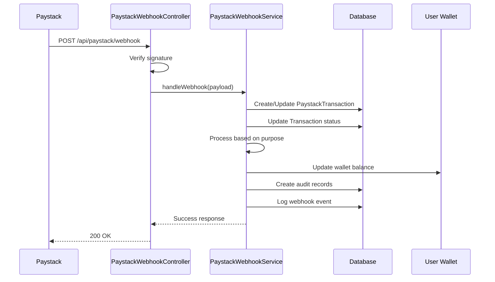

# Paystack Webhook Implementation Guide

## Overview

The Paystack webhook system is **fully implemented** and handles payment confirmations, withdrawal processing, and subscription management. The implementation mirrors the Stripe webhook functionality to ensure consistency across payment providers.

## Webhook Endpoint

**URL**: `POST /api/paystack/webhook`  
**Authentication**: Webhook signature verification using `x-paystack-signature` header

## Required Environment Variables

Before using Paystack webhooks, ensure these environment variables are configured:

```env
PAYSTACK_SECRET_KEY=sk_test_xxxxxxxxxxxxx
PAYSTACK_PUBLIC_KEY=pk_test_xxxxxxxxxxxxx
PAYSTACK_BASE_URL=https://api.paystack.co
PAYSTACK_WEBHOOK_SECRET=your_webhook_secret_here
PAYSTACK_MERCHANT_EMAIL=your-merchant@email.com
```

## Supported Events

### 1. `charge.success` - Payment Completed ✅

**Purpose**: Handles successful payment confirmations for digital book purchases and orders.

**Processing Logic**:
- Creates/updates PaystackTransaction record
- Updates main Transaction status to 'succeeded'
- Processes digital book purchases (grants access, updates analytics)
- Processes orders (updates status, handles author payouts)
- Creates payment audit records
- Logs webhook events

**Example Payload**:
```json
{
  "event": "charge.success",
  "data": {
    "id": 1234567890,
    "reference": "paystack_123_abc456",
    "amount": 250000,
    "currency": "NGN",
    "status": "success",
    "paid_at": "2025-01-15T10:30:00.000Z",
    "customer": {
      "email": "user@example.com",
      "customer_code": "CUS_xxxxx"
    },
    "channel": "card",
    "gateway_response": "Successful"
  }
}
```

### 2. `transfer.success` - Transfer Completed ✅

**Purpose**: Handles successful withdrawal/payout confirmations.

**Processing Logic**:
- Finds withdrawal record by reference
- Updates withdrawal status to 'completed'
- Updates related transaction status
- Logs successful transfer

**Example Payload**:
```json
{
  "event": "transfer.success",
  "data": {
    "reference": "withdrawal_456_def789",
    "transfer_code": "TRF_xxxxx",
    "amount": 100000,
    "currency": "NGN",
    "status": "success"
  }
}
```

### 3. `transfer.failed` - Transfer Failed ✅

**Purpose**: Handles failed withdrawal/payout attempts.

**Processing Logic**:
- Finds withdrawal record by reference
- Updates withdrawal status to 'failed'
- Records failure reason
- Refunds user wallet balance
- Updates related transaction status

### 4. `subscription.create` - Subscription Created ✅

**Purpose**: Handles new subscription activations.

**Processing Logic**:
- Finds user by customer email
- Updates/creates UserSubscription record
- Sets subscription status to 'active'
- Records provider subscription ID

### 5. `subscription.disable` - Subscription Cancelled ✅

**Purpose**: Handles subscription cancellations.

**Processing Logic**:
- Finds subscription by provider ID
- Updates status to 'cancelled'
- Records cancellation timestamp

## Security Features

### Signature Verification

All webhook requests are verified using HMAC-SHA512:

```php
$secret = config('services.paystack.webhook_secret');
$computedSignature = hash_hmac('sha512', $payload, $secret);
return hash_equals($computedSignature, $providedSignature);
```

### Request Validation

- Validates webhook signature before processing
- Returns 401 for invalid signatures
- Logs all webhook events for audit purposes

## Database Integration

### Tables Used

1. **`paystack_transactions`** - Stores Paystack-specific transaction data
2. **`transactions`** - Main transaction records
3. **`payment_audits`** - Payment audit logs
4. **`webhook_events`** - Webhook event history
5. **`withdrawals`** - Withdrawal requests and status
6. **`user_subscriptions`** - User subscription management

### Transaction Processing Flow



## Error Handling

### Failure Scenarios

1. **Invalid Signature**: Returns 401 Unauthorized
2. **Processing Errors**: Logged with full context, returns 200 to prevent retries
3. **Database Errors**: Wrapped in transactions for consistency
4. **Missing Records**: Gracefully handled with appropriate logging

### Retry Logic

- Paystack automatically retries failed webhooks
- Implementation returns 200 on processing errors to prevent infinite retries
- Failed events are logged for manual investigation

## Testing the Webhook

### 1. Local Testing with ngrok

```bash
# Install ngrok
npm install -g ngrok

# Expose local server
ngrok http 8000

# Configure webhook URL in Paystack dashboard
https://your-ngrok-url.ngrok.io/api/paystack/webhook
```

### 2. Test Events

Use Paystack's webhook testing tools in the dashboard to send test events.

### 3. Manual Testing

```bash
# Test webhook endpoint
curl -X POST http://localhost:8000/api/paystack/webhook \
  -H "Content-Type: application/json" \
  -H "x-paystack-signature: generated_signature" \
  -d '{"event": "charge.success", "data": {...}}'
```

## Monitoring and Debugging

### Logs

All webhook events are logged with appropriate levels:

```php
Log::info('Paystack charge success handled', $data);
Log::warning('Paystack transfer failed', $data);
Log::error('Paystack webhook error: ' . $e->getMessage());
```

### Webhook Event Records

Every webhook is stored in the `webhook_events` table for audit purposes:

```sql
SELECT * FROM webhook_events 
WHERE service = 'paystack' 
ORDER BY created_at DESC;
```

### Common Issues

1. **Signature Mismatch**: Check webhook secret configuration
2. **Transaction Not Found**: Verify reference format consistency
3. **User Not Found**: Check customer email mapping
4. **Duplicate Processing**: Idempotency handled via database constraints

## Comparison with Stripe Implementation

| Feature | Stripe | Paystack | Status |
|---------|--------|----------|--------|
| Payment Confirmation | ✅ | ✅ | Complete |
| Order Processing | ✅ | ✅ | Complete |
| Digital Book Purchase | ✅ | ✅ | Complete |
| Withdrawal Processing | ✅ | ✅ | Complete |
| Subscription Management | ✅ | ✅ | Complete |
| Signature Verification | ✅ | ✅ | Complete |
| Audit Logging | ✅ | ✅ | Complete |
| Error Handling | ✅ | ✅ | Complete |

## Next Steps

The Paystack webhook implementation is **production-ready**. To deploy:

1. Configure environment variables
2. Set webhook URL in Paystack dashboard
3. Test with staging transactions
4. Monitor webhook event logs
5. Set up alerting for failed webhooks

## Support

For issues or questions about the webhook implementation:

1. Check the logs in `storage/logs/laravel.log`
2. Review webhook events in the database
3. Verify environment configuration
4. Test signature verification separately

The implementation follows the same patterns as the Stripe webhook system, ensuring consistent behavior across payment providers.
